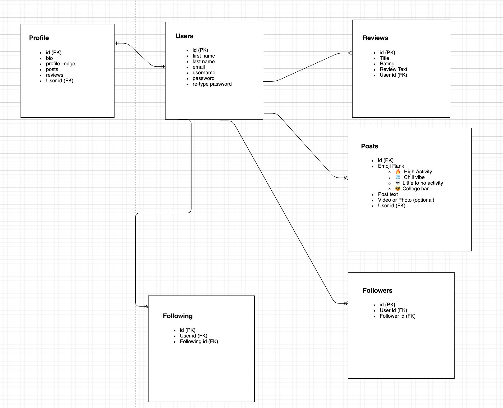

# Barlet

## Description

This is a social media app that is mix of Twitter and Yelp, but with an emphasis on bars/pubs. Key features of this project include rendering nearest bar locations using React-Google-Maps, photo uploads to the server using Multer, and incorporating an infinite scroll using the Intersection Observer API. This is only version 1, future updates coming soon.

## Wire-framing

  

  

## Screenshots

  

  

  

## Website Color Palette

  

## Key Features

## Technologies Used

**Client Side**:

- React/Redux
- React Router
- Styled Components
- React Toastify
- Font Awesome
- Antd Design Library
- React Player
- React Google Maps API

**Server Side**:

- Node.js
- Express.js
- JSON Web Token (JWT)
- PostgreSQL
- Sequelize
- Bcrypt
- Multer

**NPM Packages**:

`Client`:

- “react-redux”: “^7.2.4”
- “react-router-dom”: “^5.2.0”
- “react-scripts”: “4.0.3”
- “react-toastify”: “^7.0.4”
- “redux”: “^4.1.0”
- “redux-logger”: “^3.0.6”
- “styled-components”: “^5.3.0”
- “@ant-design/icons”: “^4.6.2”
- “@fortawesome/fontawesome-svg-core”: “^1.2.35”
- “@fortawesome/free-solid-svg-icons”: “^5.15.3”
- “@fortawesome/react-fontawesome”: “^0.1.14”
- “@react-google-maps/api”: “^2.2.0”
- “react-player”: “^2.9.0”

`Server`:

- “bcrypt”: “^5.0.1”
- “cors”: “^2.8.5”
- “dotenv”: “^10.0.0”
- “express”: “^4.17.1”
- “jsonwebtoken”: “^8.5.1”
- “sequelize”: “^6.6.2”
- “sequelize-cli”: “^6.2.0”
- “multer”: “^1.4.2”
- “pg”: “^8.6.0”

## Challenges

1. Creating custom hamburger menu and having it render at a certain break-point.
2. Deciding when it was appropriate store a state variable in the Redux store or just store it in local state.
3. Having the make the decision to not use Formik for form submission. It was taking up too much time.
4. Working with Google Maps API was very difficult and it took up the most time in this project. The biggest challenge of setting it up was allowing geo-location search while also allowing a user to freely scroll way and render new results.
5. Found a notable bug, while working on the live-feed feature I noticed that all posts and reviews would all show that they belonged to the logged in user. To get around this I made a new end point that will check user-ID of the post and render its proper owner.
6. Infinite scroll feature was also very difficult to implement. At first I was planning to use React-Infinite-Scroll-Component, but it didn’t work well with how I paginated my database. So I then decided to implement it manually using the Intersection Observer API along with React Hooks (useState, useEffect, useRef, useCallback).
7. There was a learning curve when it came to using Multer for photo uploads. I had to learn how to properly store them on the back-end and how to access them from the front-end.

## What was Learned?

- Became more familiar with the useRef and useCallback hooks and when it's appropriate to implement them.
- Gained an overall better understanding of the Google Maps API and how use it in React.
- Was able to successfully implement Intersection Observer API and Geolocation API.
- Learned how to upload photos and store them on the server using Multer. I also learned how to access multer uploads from the front-end.
- Learned how to manulally setup an infinite scroll and paginate a database.
- Figured out that it's possible to conditionally set props on React components.
